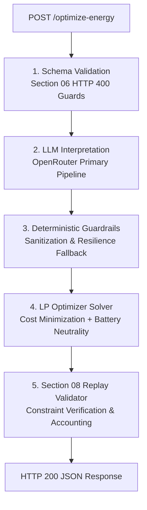

# ⚡ GridWise — LLM-Assisted Smart Campus Microgrid Energy Optimizer

> **BUP CSE Fest 2026 · Hackathon · Online Preliminary**  
> An automated, production-grade microgrid optimization engine that bridges natural language operator notes with deterministic Mixed-Integer / Linear Programming (MILP) battery scheduling.

---

## 📌 Overview

GridWise optimizes a 24-hour campus energy schedule (hours 0 to 23) by co-optimizing rooftop solar generation, battery energy storage (BESS), and grid imports to minimize total electricity cost (BDT). 

The system implements a **two-tier architecture**:
1. **Generative AI Directive Parser**: Uses an LLM via OpenRouter to read unstructured operator notes (maintenance notices, weather shifts, equipment isolation, grid limits) and translate them into machine-checkable JSON directives.
2. **Deterministic LP Optimization & Replay Engine**: Solves the optimal 24-hour schedule using Linear Programming, followed by an automated **Section 08 Replay Validator** that verifies all physical grid laws and operator directives before responding.

---

## 🏗️ Architecture & Pipeline Flow



### 1. Request Validation (Section 06 Contract)
- Validates that `scenario_id` is a non-empty string.
- Ensures `operator_notes` is an array of strings.
- Enforces exactly 24 hour records (0 to 23) with numeric `demand_kwh`, `solar_kwh`, and `tariff_bdt_per_kwh`.
- Validates all battery parameters (`capacity_kwh`, `initial_energy_kwh`, `minimum_energy_kwh`, `max_charge_kwh_per_hour`, `max_discharge_kwh_per_hour`).
- Returns clean **HTTP 400 Bad Request** if any field is missing or structurally invalid.

### 2. LLM Operator Note Interpretation (`services/aiServices.js`)
- Primary extraction pipeline powered by OpenRouter.
- The prompt is dynamically injected with the campus `batteryCapacity` to allow the LLM to calculate exact percentage-based reserve requirements (e.g., *"keep 50% in the battery"* on a 200 kWh system → `100 kWh`).
- Enforces strict JSON Schema with 6 supported directive types:
  1. `solar_reduction`: Usable solar fraction remaining (e.g., 80% reduction → `factor = 0.20`).
  2. `minimum_battery_reserve`: Elevated minimum state-of-charge during emergency/testing windows.
  3. `no_charge_window`: Complete charger isolation/outage hours.
  4. `no_discharge_window`: Disallow battery discharge during relay/protection testing.
  5. `max_grid_window`: Feeder, transformer, or substation grid import ceiling (kWh).
  6. `no_op`: Irrelevant distractors (campus news, registration deadlines, library notices).
- Operates in whole-hour intervals (0–23), start-inclusive and end-exclusive (e.g., "noon until 2 PM" → `[12, 13]`).

### 3. Deterministic Guardrails (`services/guardrails.js`)
- Sanitizes LLM outputs against physical boundary bounds:
  - Clamps `factor` between `0.0` and `1.0`.
  - Clamps `minimum_energy_kwh` between `0` and `batteryCapacity`.
  - Normalizes and sorts hour intervals `[0 ... 23]`.
  - Forces `applies: false` and `structured_adjustment: null` on `no_op`.
- Includes a regex-based fallback to preserve uptime if the external LLM provider encounters network outages or upstream rate limits.

### 4. Linear Programming Optimizer (`services/optimizerService.js`)
- Built on `javascript-lp-solver`.
- **Objective Function**: Minimize total grid import expenditure:
  ```text
  minimize Cost = Σ [ grid_kwh[h] × tariff_bdt_per_kwh[h] ] + ε · (charge[h] + discharge[h]) + ε_peak · peak_grid
  ```
- **Physical Constraints**:
  - **Power Balance**:
    `grid_kwh[h] + solar_used_kwh[h] + discharge[h] = demand_kwh[h] + charge[h]`
  - **Battery Storage Bounds**:
    `active_min_reserve[h] <= SoC[h] <= capacity_kwh`
  - **Inverter Hourly Limits**:
    `charge[h] <= max_charge_kwh_per_hour`  
    `discharge[h] <= max_discharge_kwh_per_hour`
  - **Directive Enforcement**:
    - `no_charge_window`: `charge[h] = 0`
    - `no_discharge_window`: `discharge[h] = 0`
    - `max_grid_window`: `grid_kwh[h] <= max_grid_kwh`
    - `solar_reduction`: `usable_solar[h] = raw_solar[h] × factor`
  - **End-of-Day Neutrality**:
    `SoC[23] = initial_energy_kwh` (strictly enforced with zero-balance constraint `Σ charge = Σ discharge`).

### 5. Section 08 Replay Validator (`services/guardrails.js`)
- Post-optimization verification step executed before returning the schedule to the client:
  - Replays all 24 hours against extracted directives to ensure no constraint was breached.
  - Re-evaluates exact physical power balance and battery continuity:
    `SoC[h] = SoC[h-1] + charge[h] - discharge[h]`
  - Recalculates mathematical summary totals:
    - `total_grid_kwh = Σ grid_kwh[h]`
    - `total_cost_bdt = round( Σ (grid_kwh[h] × tariff[h]) )`
    - `peak_grid_kwh = max( grid_kwh[h] )`

---

## 📡 API Reference

### 1. Health Check
```http
GET /health
```
**Response (200 OK):**
```json
{
  "status": "ok"
}
```

---

### 2. Optimize Energy Schedule
```http
POST /optimize-energy
Content-Type: application/json
```

#### Request Payload Example:
```json
{
  "scenario_id": "SAMPLE-01",
  "operator_notes": [
    "Facilities will wash the rooftop solar panels from noon until 2 PM. During cleaning, usable solar should be treated as roughly 25% of the forecast.",
    "The sports office moved next month's registration deadline."
  ],
  "hours": [
    { "hour": 0, "demand_kwh": 90, "solar_kwh": 0, "tariff_bdt_per_kwh": 6 },
    { "hour": 1, "demand_kwh": 85, "solar_kwh": 0, "tariff_bdt_per_kwh": 6 }
    // ... exactly 24 hours (0 to 23)
  ],
  "battery": {
    "capacity_kwh": 220,
    "initial_energy_kwh": 110,
    "minimum_energy_kwh": 40,
    "max_charge_kwh_per_hour": 50,
    "max_discharge_kwh_per_hour": 50
  }
}
```

#### Response Example (200 OK):
```json
{
  "scenario_id": "SAMPLE-01",
  "directive_interpretation": [
    {
      "note_index": 0,
      "applies": true,
      "directive_type": "solar_reduction",
      "structured_adjustment": {
        "hours": [12, 13],
        "factor": 0.25
      },
      "explanation": "Panel washing noon-2 PM reduces usable solar to 25%."
    },
    {
      "note_index": 1,
      "applies": false,
      "directive_type": "no_op",
      "structured_adjustment": null,
      "explanation": "Sports office notice does not affect energy schedule."
    }
  ],
  "hourly_plan": [
    {
      "hour": 0,
      "grid_kwh": 50.0,
      "solar_used_kwh": 0.0,
      "battery_action": "discharge",
      "battery_kwh": 40.0,
      "battery_energy_after_kwh": 70.0
    }
    // ... exactly 24 entries
  ],
  "total_grid_kwh": 2692.5,
  "total_cost_bdt": 38365,
  "peak_grid_kwh": 175.0,
  "plan_summary": "Optimized 24-hour campus energy schedule satisfying all operator directives, physical battery bounds, and end-of-day neutrality."
}
```

---

## 📁 Project Structure

```text
├── server.js                     # Express entry point, HTTP 400 validation, port binding (0.0.0.0:5000)
├── services/
│   ├── aiServices.js             # OpenRouter LLM integration, prompt engineering & JSON extraction
│   ├── guardrails.js             # Directive sanitization, regex fallback, Section 08 Replay Validator
│   └── optimizerService.js       # Linear programming optimization solver (javascript-lp-solver)
├── test-cases.js                 # Automated test suite running 10 benchmark test cases
├── test.js                       # Quick single-scenario validation script
├── package.json                  # Project dependencies and npm scripts
└── .env                          # Environment configuration (PORT, API Keys, Model slug)
```

---

## 🚀 Setup & Installation

### Prerequisites
- [Node.js](https://nodejs.org/) (v18.x or higher)
- NPM

### 1. Clone & Install
```bash
git clone https://github.com/Nakib64/bup_prili.git
cd bup_prili
npm install
```

### 2. Configure Environment Variables
Create a `.env` file in the root directory:
```env
PORT=5000
OPENROUTER_API_KEY=your_openrouter_api_key_here
OPENROUTER_MODEL=openrouter/auto
```

### 3. Start the Server
```bash
npm start
# or
node server.js
```
The server will bind to `http://0.0.0.0:5000`.

---

## 🧪 Testing & Verification

Run the benchmark test suite against the live server:

```bash
# Test local server
node test-cases.js

# Test remote VPS server
API_URL=http://<VPS_IP>:5000/optimize-energy node test-cases.js
```

### Benchmark Results
```text
Starting execution across 10 benchmark test cases...

• [SAMPLE-01] Solar cleaning + distractor          PASS | Cost: 38365 BDT | Grid: 2692.5 kWh
• [SAMPLE-02] Battery charging maintenance         PASS | Cost: 42885 BDT | Grid: 2915 kWh
• [SAMPLE-03] Emergency reserve as percentage      PASS | Cost: 35480 BDT | Grid: 2430 kWh
• [SAMPLE-04] No-discharge protection test         PASS | Cost: 40495 BDT | Grid: 2645 kWh
• [SAMPLE-05] Temporary feeder grid cap            PASS | Cost: 33950 BDT | Grid: 2430 kWh
• [SAMPLE-06] Multiple notes with distractor       PASS | Cost: 34090 BDT | Grid: 2395 kWh
• [SAMPLE-07] Reserve plus transformer cap         PASS | Cost: 38550 BDT | Grid: 2560 kWh
• [SAMPLE-08] Separate charge/discharge outages    PASS | Cost: 37665 BDT | Grid: 2490 kWh
• [SAMPLE-09] Reduction wording normalization      PASS | Cost: 34873 BDT | Grid: 2504 kWh
• [SAMPLE-10] Multi-constraint evening operation   PASS | Cost: 41620 BDT | Grid: 2715 kWh

======================================================
Summary: 10 / 10 cases passed.
======================================================
```

---

## 🛡️ Reliability & Edge Case Handling

| Edge Case | Strategy |
|---|---|
| **Ambiguous Percentage Reserves** | System prompt passes battery capacity so the LLM evaluates exact numbers (`percentage% × capacity_kwh`). |
| **Malformed LLM Output** | Robust JSON extraction isolates outermost `{...}` braces; invalid outputs route to the deterministic parser. |
| **Hour Window Parsing** | Standardizes "noon", "midnight", AM/PM, and 24-hour time to zero-indexed half-open intervals `[start, end)`. |
| **Simultaneous Chg/Dischg** | Micro-penalties on battery turnover variables prevent wasteful cycling during identical tariff intervals. |
| **End-of-Day Neutrality** | Constrains net energy flux to zero (`Σ charge - Σ discharge = 0`), guaranteeing `SoC[23] = initial_energy_kwh`. |
| **Accounting Discrepancies** | Replay Validator re-aggregates `Σ grid` and `Σ (grid × tariff)` directly from final hourly actions. |
